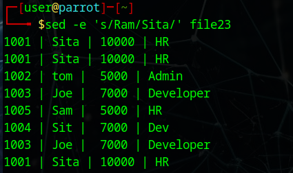
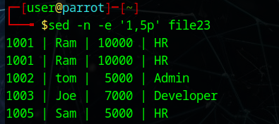

# OS-Linux-commands-Shell-scripting
Operating systems Lab exercise
# Linux commands-Shell scripting
Linux commands-Shell scripting

# AIM:
To practice Linux Commands and Shell Scripting

# DESIGN STEPS:

### Step 1:

Navigate to any Linux environment installed on the system or installed inside a virtual environment like virtual box/vmware or online linux JSLinux (https://bellard.org/jslinux/vm.html?url=alpine-x86.cfg&mem=192) or docker.

### Step 2:

Execute the following commands

### Step 3:

Testing the commands for the desired output. 

# COMMANDS:
### Create the following files file1, file2 as follows:
cat > file1
```
chanchal singhvi
c.k. shukla
s.n. dasgupta
sumit chakrobarty
^d
```
cat > file2
```
anil aggarwal
barun sengupta
c.k. shukla
lalit chowdury
s.n. dasgupta
^d
```
### Display the content of the files
cat < file1
## OUTPUT


cat < file2
## OUTPUT


# Comparing Files
cmp file1 file2
## OUTPUT

 
comm file1 file2
 ## OUTPUT

 
diff file1 file2
## OUTPUT


#Filters

### Create the following files file11, file22 as follows:

cat > file11
```
Hello world
This is my world
^d
```
cat > file22
```
1001 | Ram | 10000 | HR
1002 | tom |  5000 | Admin
1003 | Joe |  7000 | Developer
^d
```


cut -d "|" -f 2 file22
## OUTPUT


cat < newfile 
```
Hello world
hello world
^d
````
cat > newfile 
Hello world
hello world
 
grep Hello newfile 
## OUTPUT


grep hello newfile 
## OUTPUT


grep -v hello newfile 
## OUTPUT


cat newfile | grep -i "hello"
## OUTPUT


cat newfile | grep -i -c "hello"
## OUTPUT


grep -R ubuntu /etc
## OUTPUT


grep -w -n world newfile   
## OUTPUT


cat < newfile 
```
Hello world
hello world
Linux is world number 1
Unix is predecessor
Linux is best in this World
^d
```

cat > newfile
```
Hello world
hello world
Linux is world number 1
Unix is predecessor
Linux is best in this World
^d
 ```
egrep -w 'Hello|hello' newfile 
## OUTPUT


egrep -w '(H|h)ello' newfile 
## OUTPUT


egrep -w '(H|h)ell[a-z]' newfile 
## OUTPUT


egrep '(^hello)' newfile 
## OUTPUT


egrep '(world$)' newfile 
## OUTPUT


egrep '((W|w)orld$)' newfile 
## OUTPUT


egrep '[1-9]' newfile 
## OUTPUT


egrep l{2} newfile
## OUTPUT


egrep 's{1,2}' newfile
## OUTPUT 


cat > file23
```
1001 | Ram | 10000 | HR
1001 | Ram | 10000 | HR
1002 | tom |  5000 | Admin
1003 | Joe |  7000 | Developer
1005 | Sam |  5000 | HR
1004 | Sit |  7000 | Dev
1003 | Joe |  7000 | Developer
1001 | Ram | 10000 | HR
^d
```


sed -n -e '3p' file23
## OUTPUT


sed -n -e '$p' file23
## OUTPUT


sed  -e 's/Ram/Sita/' file23
## OUTPUT



sed  -e '2s/Ram/Sita/' file23
## OUTPUT


sed  '/tom/s/5000/6000/' file23
## OUTPUT


sed -n -e '1,5p' file23
## OUTPUT



sed -n -e '2,/Joe/p' file23
## OUTPUT


sed -n -e '/tom/,/Joe/p' file23
## OUTPUT


seq 10 
## OUTPUT


seq 10 | sed -n '4,6p'
## OUTPUT


seq 10 | sed -n '2,~4p'
## OUTPUT


seq 3 | sed '2a hello'
## OUTPUT


seq 2 | sed '2i hello'
## OUTPUT


seq 10 | sed '2,9c hello'
## OUTPUT


sed -n '2,4{s/^/$/;p}' file23
## OUTPUT


sed -n '2,4{s/$/*/;p}' file23
## OUTPUT


#Sorting File content
cat > file21
```
1001 | Ram | 10000 | HR
1002 | tom |  5000 | Admin
1003 | Joe |  7000 | Developer
1005 | Sam |  5000 | HR
1004 | Sit |  7000 | Dev
``` 
sort file21
## OUTPUT


cat > file22
```
1001 | Ram | 10000 | HR
1001 | Ram | 10000 | HR
1002 | tom |  5000 | Admin
1003 | Joe |  7000 | Developer
1005 | Sam |  5000 | HR
1004 | Sit |  7000 | Dev
``` 
uniq file22
## OUTPUT


#Using tr command

cat file23 | tr [:lower:] [:upper:]
 ## OUTPUT
 

cat < urllist.txt
```
www. yahoo. com
www. google. com
www. mrcet.... com
^d
 ```
cat > urllist.txt
```
www. yahoo. com
www. google. com
www. mrcet.... com
 ```
cat urllist.txt | tr -d ' '
 ## OUTPUT


 
cat urllist.txt | tr -d ' ' | tr -s '.'
## OUTPUT


#Backup commands
tar -cvf backup.tar *
## OUTPUT


mkdir backupdir
 
mv backup.tar backupdir

cd backupdir
 
tar -tvf backup.tar
## OUTPUT


tar -xvf backup.tar
## OUTPUT

gzip backup.tar

ls .gz
## OUTPUT
 
gunzip backup.tar.gz
## OUTPUT

 
# Shell Script
```

# RESULT:
The Commands are executed successfully.
